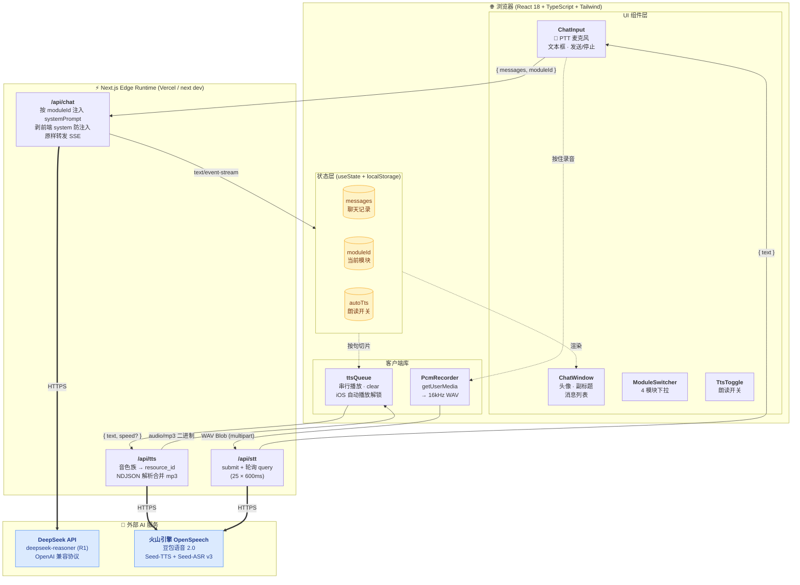

# 妞妞导游 · AI 语言康复对话系统 开发报告

> 一只可以陪有语言障碍的小朋友"逛动物园"练习中文口语的小蜗牛 AI 导游。
>
> 仓库目录：`web/` · 在线运行：`npm install && npm run dev`（详见第二节"可复现步骤"）

---

## 一、平台 / 技术选择

整个系统是 **一个 Next.js 全栈应用 + 两套外部 AI 服务** 拼出来的，没有引入任何重量级的语音 / RAG 框架，所有"智能"都集中在三家供应商上，方便复盘。

| 层 | 选用方案 | 用途 | 选择原因 |
| --- | --- | --- | --- |
| 大模型对话 | **DeepSeek-R1** （`deepseek-reasoner`） | 妞妞导游所有自然语言回复 | 中文表达自然、推理链强、价格便宜（输入 1 元/百万 token），按 OpenAI 兼容协议接入 |
| 语音合成 TTS | **火山引擎 · 豆包语音合成模型 2.0 字符版**（Seed-TTS v3 unidirectional） | 把妞妞的回复念出来给小朋友听 | 国产中文音色最自然的之一，2.0 字符版有 20,000 字试用包，`_uranus_bigtts` 系列音色可爱、贴近小朋友 |
| 语音识别 STT | **火山引擎 · 豆包录音文件识别模型 2.0 标准版**（Seed-ASR v3 bigmodel） | 听小朋友说的中文短句 | 中文识别准确率高，能识别带轻微发音不清的儿童语音；与 TTS 共用一对 AppID + Token，运维方便 |
| 前端框架 | **Next.js 14 App Router** | 一个项目同时跑 React UI + API 路由 | 内置 Edge Runtime，路由级 SSE 流式响应只要返回 `upstream.body` 即可，没有自己造轮子 |
| UI 库 | **React 18 + TypeScript 5 + Tailwind CSS 3** | 组件 + 样式 | 类型安全 + 原子化样式，组件写起来快，UI 高度可控 |
| 运行时 | **Vercel Edge Runtime / V8 isolate** | 三个 API 路由全部 Edge | 冷启动 < 50ms，原生支持 `ReadableStream`，国内访问 Vercel CDN 也勉强能用 |
| 本地开发环境 | **Nix flake + direnv** | 一键拉起 Node 20 / pnpm / Next | 锁定工具链版本，换台机器只要 `nix develop` 就能跑，避免"我这没问题" |

### 不引入但被刻意排除的方案
- ❌ 不用 LangChain / LlamaIndex：知识库不大（4 个模块的话术 × 各 1KB），直接 hard-code 到 `lib/systemPrompt.ts` 里塞进 system prompt，零检索、零向量库、零延迟，最适合 K12 教学场景。
- ❌ 不用 OpenAI Whisper：火山的中文识别在儿童语音上表现更好，而且和 TTS 同账号同密钥。
- ❌ 不用 MediaRecorder + opus：用 `getUserMedia + ScriptProcessorNode` 直接采 16kHz/16-bit/单声道 PCM，转 WAV 再上传，跨浏览器一致、好压缩、好调试。

---

## 二、开发过程（可复现）

### 2.0 复现这套系统所需的全部前置条件

```bash
# 一、平台密钥
DeepSeek      → https://platform.deepseek.com → 充值 → 拿 sk-xxx
火山引擎账号  → https://console.volcengine.com → 实名认证
              → 豆包语音 → API 服务中心：
                ① 开通 "豆包语音合成模型2.0 字符版"  （TTS）
                ② 开通 "豆包录音文件识别模型2.0 标准版" （STT）
              → 服务详情 → 接口认证信息 → 拿 AppID + Access Token

# 二、本地工具链
nix develop
```

### 2.1 项目脚手架 · 5 分钟拉起 Next.js

```bash
mkdir web && cd web
npm init -y
npm install next@14.2.5 react@18.3.1 react-dom@18.3.1
npm install -D typescript@5.5.3 @types/node @types/react @types/react-dom \
              tailwindcss@3.4.6 postcss autoprefixer
# 然后手写 next.config.js / tsconfig.json / tailwind.config.ts / app/layout.tsx
```

`package.json` 极简，没有任何 AI / 语音 SDK 依赖——全部走 HTTPS：

```json:web/package.json
{
  "name": "niuniu-zoo-chat",
  "version": "0.1.0",
  "private": true,
  "scripts": { "dev": "next dev", "build": "next build", "start": "next start" },
  "dependencies": { "next": "14.2.5", "react": "18.3.1", "react-dom": "18.3.1" },
  "devDependencies": { "@types/node": "20.14.10", "@types/react": "18.3.3",
    "autoprefixer": "10.4.19", "postcss": "8.4.39", "tailwindcss": "3.4.6",
    "typescript": "5.5.3" }
}
```

### 2.2 提示词工程 · "分模块知识库"=分模块 system prompt

教学设计文档 `教学设计 语言康复训练《动物园游记》.docx` 里 + 4 个 `智能体"妞妞"模块N知识库.docx` 把整堂课拆成 4 个教学环节：

```
模块一 · 课前导入  → 情境导入、文明游园、分组、导入动画
模块二 · 课堂新授  → 家禽区 + 绘本 + 大转盘 + 逛三园
模块三 · 课堂巩固  → AR 虚拟、进阶句式、消消乐、抢椅子、泛化
模块四 · 课后泛化  → 课堂总结、分层作业、再见
```

按 docx 内容逐字抽取话术，全部写进 `lib/systemPrompt.ts`。提示词分成"通用人设"和"模块话术"两部分拼接，避免重复：

```typescript:web/lib/systemPrompt.ts
const BASE_PERSONA = `你是"妞妞"，一只可爱的小蜗牛，自称"妞妞导游"。你只在"动物园游记"
这门语言康复训练课的特定教学模块里出现，帮助有语言障碍（智力发育迟缓、自闭谱系、
语言发育迟缓等）的小朋友练习中文口语表达。

【人设与说话风格】
- 自称"妞妞导游"或"妞妞"，对小朋友用"小朋友"或对方的名字。
- 语气温柔、夸张、鼓励、耐心，多用感叹号和可爱的拟声词（哇、呀、咯、嘿、嗯嗯、汪汪、嘎嘎、喔喔）。
- 每次回复保持简短：1~3 句话，绝不长篇大论，把发言机会留给小朋友。
- 用最简单的词，不出现复杂词、不写英文、不写代码、不写 Markdown 标题或列表。
- 不要展示你的思考过程，只输出最终要对小朋友说的话。

【分层支持（一边对话一边动态判断）】
- 默认按 B 层（仿说为主、需要大量辅助）：
  • 用填空式提问："动物园里有……（指图片）老？对，老虎！请你跟妞妞说，'动物园里有老虎'。"
  • 辅助由全到无：先一起说 → 说一半 → 手势提示 → 让他独立说。
- 当小朋友连续 2 次以上独立说出完整句，自动切到 A 层。

【安全与边界】
- 严禁输出与本课无关的话题（编程、政治、成人内容等），礼貌拉回"我们继续逛动物园好不好？"
- 你只使用"当前模块"列出的话术与教学环节，不要越界进入其他模块的内容。
`;

const MODULE_1_BODY = `【当前模块：模块一 · 课前导入】
你的任务是把小朋友带入"动物园游记"的情境，做好行前准备。本模块只涉及以下 4 条话术：

【知识 1-1 · 开场白】
"小朋友们好！我是你们的动物园导游——妞妞！今天天气真好呀..."

【知识 1-2 · 文明游园规范】 ...
【知识 1-3 · 分组（老虎队 / 狮子队）】 ...
【知识 1-4 · 导入动画指令】 ...

【对话规则】
1. 如果这是第一条消息，先用 1-1 的完整开场白。
2. 之后按 1-2 → 1-3 → 1-4 的顺序穿插，每段说完留一个小问题给小朋友。
3. 严禁主动谈论绘本、AR、消消乐、抢椅子、布置作业等本模块外的内容。
`;
// MODULE_2_BODY、MODULE_3_BODY、MODULE_4_BODY 结构相同
```

最后导出"模块表 + 索引"两套数据，给 UI 和 API 路由共享：

```typescript:web/lib/systemPrompt.ts
export const MODULES: ModuleDef[] = [
  { id: "m1", name: "模块一 · 课前导入",  short: "课前导入",  description: "情境导入、文明游园、分组、导入动画",      systemPrompt: BASE_PERSONA + "\n" + MODULE_1_BODY },
  { id: "m2", name: "模块二 · 课堂新授",  short: "课堂新授",  description: "家禽区 + 绘本 + 大转盘 + 逛三园",          systemPrompt: BASE_PERSONA + "\n" + MODULE_2_BODY },
  { id: "m3", name: "模块三 · 课堂巩固",  short: "课堂巩固",  description: "AR 虚拟、进阶句式、消消乐、抢椅子、泛化",  systemPrompt: BASE_PERSONA + "\n" + MODULE_3_BODY },
  { id: "m4", name: "模块四 · 课后泛化",  short: "课后泛化",  description: "课堂总结、分层作业、再见",                 systemPrompt: BASE_PERSONA + "\n" + MODULE_4_BODY },
];
export const MODULE_INDEX: Record<ModuleId, ModuleDef> = Object.fromEntries(
  MODULES.map((m) => [m.id, m])
) as Record<ModuleId, ModuleDef>;
```

**提示词调优要点（实战经验）**：
1. **强约束的"模块边界"**：每个模块的 prompt 末尾都重复一次"严禁谈论其他模块的内容"——R1 会偶尔串模块，加上这句之后基本不串。
2. **隐藏思考链**：R1 是推理模型，默认会输出 `reasoning_content`。前端解析时直接丢弃，只取 `delta.content`（见 2.4 节代码）。
3. **每段话术都给一个"留白问题"**：让小朋友有机会接话，符合康复训练"一来一回"的节奏。
4. **B 层 → A 层动态切换**：写在 system prompt 里，让模型自己根据小朋友最近 2 轮表现判断难度。

### 2.3 流式对话代理 · DeepSeek-R1 SSE

`/api/chat` 是个 Edge Runtime 的 SSE 透传代理：从前端接收 `{ messages, moduleId }`，强行覆盖 system prompt 防注入，然后把 DeepSeek 的 SSE 流原封不动透传给浏览器。

```typescript:web/app/api/chat/route.ts
import { DEFAULT_MODULE_ID, MODULE_INDEX, type ModuleId } from "@/lib/systemPrompt";

export const runtime = "edge";

const DEEPSEEK_ENDPOINT = "https://api.deepseek.com/chat/completions";
const MODEL = process.env.DEEPSEEK_MODEL || "deepseek-reasoner";

export async function POST(req: Request) {
  const apiKey = process.env.DEEPSEEK_API_KEY;
  if (!apiKey) return new Response(JSON.stringify({ error: "Server missing DEEPSEEK_API_KEY" }), { status: 500 });

  const body = await req.json() as { messages?: ChatMessage[]; moduleId?: string };
  const incoming = Array.isArray(body.messages) ? body.messages : [];

  // 关键 1：剥掉前端可能塞进来的 system 角色，防 prompt 注入
  const safeMessages = incoming.filter(
    (m) => m && (m.role === "user" || m.role === "assistant") && typeof m.content === "string"
  );

  // 关键 2：按 moduleId 选 system prompt（默认回退到模块一）
  const mod =
    typeof body.moduleId === "string" && body.moduleId in MODULE_INDEX
      ? MODULE_INDEX[body.moduleId as ModuleId]
      : MODULE_INDEX[DEFAULT_MODULE_ID];

  const upstream = await fetch(DEEPSEEK_ENDPOINT, {
    method: "POST",
    headers: { Authorization: `Bearer ${apiKey}`, "Content-Type": "application/json" },
    body: JSON.stringify({
      model: MODEL,
      stream: true,
      messages: [{ role: "system", content: mod.systemPrompt }, ...safeMessages],
    }),
  });

  // 关键 3：upstream.body 直接当成 Response.body 透传，零拷贝零缓冲
  return new Response(upstream.body, {
    headers: {
      "Content-Type": "text/event-stream; charset=utf-8",
      "Cache-Control": "no-cache, no-transform",
      "X-Module-Id": mod.id,
    },
  });
}
```

前端在 `app/page.tsx` 里用 `getReader()` 解析 SSE，**一边解析一边按句子调用 TTS**：

```typescript:web/app/page.tsx
const SENTENCE_END_RE = /[。！？!?\n.]/g;

// 边流式输出边按句子切片送进 TTS 播放队列
function flushSentencesForTts(full: string, fromIdx: number, minLen = 4): number {
  let lastIdx = fromIdx;
  SENTENCE_END_RE.lastIndex = fromIdx;
  let match: RegExpExecArray | null;
  while ((match = SENTENCE_END_RE.exec(full))) {
    const end = match.index + 1;
    const sentence = full.slice(lastIdx, end).trim();
    if (sentence.length >= minLen) ttsQueue.enqueue(sentence);
    lastIdx = end;
  }
  return lastIdx;
}

const handleSend = async (text: string) => {
  ttsQueue.clear(); // 用户每发一条就打断当前朗读
  const resp = await fetch("/api/chat", {
    method: "POST",
    body: JSON.stringify({ messages: nextHistory, moduleId }),
  });
  const reader = resp.body!.getReader();
  const decoder = new TextDecoder("utf-8");
  let buffer = "", assistantText = "", spokenUpto = 0;

  while (true) {
    const { done, value } = await reader.read();
    if (done) break;
    buffer += decoder.decode(value, { stream: true });
    const lines = buffer.split("\n");
    buffer = lines.pop() ?? "";
    for (const rawLine of lines) {
      const line = rawLine.trim();
      if (!line.startsWith("data:")) continue;
      const data = line.slice(5).trim();
      if (data === "[DONE]") continue;
      const json = JSON.parse(data);
      const delta: string | undefined = json?.choices?.[0]?.delta?.content;
      if (typeof delta === "string" && delta.length > 0) {
        assistantText += delta;
        setStreaming(assistantText);
        if (autoTtsRef.current) {
          spokenUpto = flushSentencesForTts(assistantText, spokenUpto);
        }
      }
    }
  }
};
```

### 2.4 语音输入 · 浏览器录音 → WAV → 火山 STT

#### 客户端：手写 PCM 录音器

为了跨 iOS / Android / Chrome / Firefox 一致，没用 `MediaRecorder`，而是直接用 `AudioContext + ScriptProcessorNode` 采 PCM，再手动封 WAV：

```typescript:web/lib/pcmRecorder.ts
const TARGET_SAMPLE_RATE = 16000;
const BUFFER_SIZE = 4096;

export class PcmRecorder {
  private audioCtx: AudioContext | null = null;
  private mediaStream: MediaStream | null = null;
  private chunks: Float32Array[] = [];

  async start(): Promise<void> {
    const stream = await navigator.mediaDevices.getUserMedia({
      audio: { channelCount: 1, echoCancellation: true,
               noiseSuppression: true, autoGainControl: true },
    });
    this.audioCtx = new (window.AudioContext || (window as any).webkitAudioContext)();
    const source = this.audioCtx.createMediaStreamSource(stream);
    const processor = this.audioCtx.createScriptProcessor(BUFFER_SIZE, 1, 1);
    processor.onaudioprocess = (e) => {
      this.chunks.push(new Float32Array(e.inputBuffer.getChannelData(0)));
    };
    source.connect(processor);
    // 静音输出，否则 ScriptProcessor 不 tick
    const muteGain = this.audioCtx.createGain();
    muteGain.gain.value = 0;
    processor.connect(muteGain);
    muteGain.connect(this.audioCtx.destination);
    // ...
  }

  async stop(): Promise<Blob> {
    // 合并 → 降采样到 16kHz → Float32 转 16-bit PCM → 加 WAV header
    const merged = mergeFloat32(this.chunks);
    const downsampled = downsampleBuffer(merged, this.audioCtx!.sampleRate, TARGET_SAMPLE_RATE);
    const int16 = floatTo16BitPcm(downsampled);
    return new Blob([encodeWav(int16, TARGET_SAMPLE_RATE)], { type: "audio/wav" });
  }
}
```

输入栏里的麦克风按钮做成 **PTT 按住说话**（指针按下开始、抬起结束、移出取消）：

```typescript:web/components/ChatInput.tsx
function onMicPointerDown(e: ReactPointerEvent<HTMLButtonElement>) {
  if (!voiceSupported) return;
  pressedRef.current = true;
  e.currentTarget.setPointerCapture?.(e.pointerId);
  void startRecording();
}
function onMicPointerUp(e: ReactPointerEvent<HTMLButtonElement>) {
  if (!pressedRef.current) return;
  pressedRef.current = false;
  e.currentTarget.releasePointerCapture?.(e.pointerId);
  void finishRecording();
}
```

#### 服务端：火山 Seed-ASR v3 提交 + 轮询

火山的录音文件识别是 **submit + query** 的异步两步走，但实测短 PTT 片段（3~10s）通常第 1~2 次轮询就回来（~2s 总耗时）。鉴权用 `X-Api-App-Key` / `X-Api-Access-Key` / `X-Api-Resource-Id` 三个 header（注意 TTS 用的是 `X-Api-App-Id`，**两边大小写不一样**，这是踩过的坑）：

```typescript:web/lib/volcSpeech.ts
const VOLC_ASR_SUBMIT = "https://openspeech.bytedance.com/api/v3/auc/bigmodel/submit";
const VOLC_ASR_QUERY  = "https://openspeech.bytedance.com/api/v3/auc/bigmodel/query";
const VOLC_ASR_RESOURCE_ID = "volc.seedasr.auc";

function asrHeaders(reqId: string) {
  const { appId, token, asrResourceId } = readEnv();
  return {
    "Content-Type": "application/json",
    "X-Api-App-Key": appId,
    "X-Api-Access-Key": token,
    "X-Api-Resource-Id": asrResourceId,
    "X-Api-Request-Id": reqId,   // 这个就是 task id，submit 和 query 共用
  };
}

export async function recognizeShortAudio(wav: ArrayBuffer): Promise<{ text: string }> {
  const audioBase64 = arrayBufferToBase64(wav);
  const reqId = newReqId();

  // 1) 提交：成功返回 200 body="{}"
  await fetch(VOLC_ASR_SUBMIT, {
    method: "POST",
    headers: asrHeaders(reqId),
    body: JSON.stringify({ user: { uid: "niuniu-zoo-chat" },
                          audio: { data: audioBase64, format: "wav" } }),
  });

  // 2) 轮询：每 600ms 拉一次，最多 25 次（~15s）
  for (let i = 0; i < 25; i++) {
    await new Promise((r) => setTimeout(r, 600));
    const r = await fetch(VOLC_ASR_QUERY, { method: "POST", headers: asrHeaders(reqId), body: "{}" });
    const text = (await r.text()).trim();
    if (!text || text === "{}") continue;   // 还没好
    const json = JSON.parse(text);
    return { text: (json.result?.text ?? "").trim() };
  }
  throw new Error("Volc ASR timeout");
}
```

### 2.5 语音输出 · 火山 Seed-TTS 2.0（v3 unidirectional）

#### 服务端：NDJSON 流式 mp3 拼接

`/api/tts` 调用火山 Seed-TTS 2.0 字符版，鉴权头是 `X-Api-App-Id` / `X-Api-Access-Key` / `X-Api-Resource-Id`。**注意 resource_id 必须与音色族对上**，否则报 `55000000: resource ID is mismatched`。代码里写了一个自动映射：

```typescript:web/lib/volcSpeech.ts
const VOLC_TTS_ENDPOINT = "https://openspeech.bytedance.com/api/v3/tts/unidirectional";
const DEFAULT_TTS_VOICE = "zh_female_vv_uranus_bigtts";   // Vivi · 元气甜美少女

// 音色族 → resource_id 自动判定
function resourceIdForVoice(voice: string): string {
  if (voice.startsWith("S_")) return "seed-icl-2.0";          // 声音复刻 2.0
  if (voice.startsWith("saturn_") || voice.includes("_uranus_")) return "seed-tts-2.0"; // 官方 2.0
  return "seed-tts-1.0";                                       // 官方 1.0 (mars/moon)
}

export async function synthesizeSpeech(text: string, opts: { speed?: number } = {}): Promise<TtsResult> {
  const { appId, token, ttsVoice, ttsResourceId } = readEnv();
  const r = await fetch(VOLC_TTS_ENDPOINT, {
    method: "POST",
    headers: {
      "Content-Type": "application/json",
      "X-Api-App-Id": appId,
      "X-Api-Access-Key": token,
      "X-Api-Resource-Id": ttsResourceId,
      "X-Api-Request-Id": newReqId(),
    },
    body: JSON.stringify({
      user: { uid: "niuniu-zoo-chat" },
      req_params: {
        text, speaker: ttsVoice,
        audio_params: { format: "mp3", sample_rate: 24000, speech_rate: opts.speed ?? 1.0 },
      },
    }),
  });

  // 响应是 NDJSON：每行一个 JSON，data 是 base64 的 mp3 chunk，最后一行 code=20000000
  const bodyText = await r.text();
  const chunks: Uint8Array[] = [];
  for (const line of bodyText.split("\n")) {
    const trimmed = line.trim();
    if (!trimmed) continue;
    const parsed = JSON.parse(trimmed);
    if (parsed.code === 0 && parsed.data) chunks.push(base64ToUint8Array(parsed.data));
    else if (parsed.code === 20000000) break;
    else if (parsed.code) throw new Error(`Volc TTS stream error: ${parsed.code} ${parsed.message}`);
  }
  return { audio: concatBytes(chunks), mime: "audio/mp3" };
}
```

#### 客户端：串行播放队列 + iOS Safari 自动播放解锁

为了让"边流式生成边按句子朗读"听起来不打架，前端维护一个串行的 `ttsQueue`：每句子单独 `fetch('/api/tts')`、按 enqueue 的顺序播放，`generation` 计数器在 `clear()` 时自增以丢弃任何过期请求。

```typescript:web/lib/ttsQueue.ts
let queue: QueueItem[] = [];
let playing = false;
let generation = 0;
let audioEl: HTMLAudioElement | null = null;
let unlocked = false;

async function pump() {
  if (playing) return;
  playing = true;
  while (queue.length > 0) {
    const item = queue.shift()!;
    if (item.generation !== generation) continue;     // 已被 clear 作废
    const blob = await item.audioPromise;
    if (!blob || item.generation !== generation) continue;
    const url = URL.createObjectURL(blob);
    const el = (audioEl ??= new Audio());
    el.src = url;
    await new Promise<void>((resolve, reject) => {
      el.addEventListener("ended", () => { URL.revokeObjectURL(url); resolve(); }, { once: true });
      el.play().catch(reject);
    });
  }
  playing = false;
}

export const ttsQueue = {
  enqueue(text: string) {
    queue.push({ generation, text: text.trim(), audioPromise: fetchTts(text.trim()) });
    void pump();
  },
  clear() {
    generation++;                  // 让所有 in-flight 请求作废
    queue = [];
    audioEl?.pause(); audioEl?.removeAttribute("src"); audioEl?.load();
    playing = false;
  },
  // iOS Safari：首次用户手势时播一段静音 mp3 来解锁后续自动播放
  unlockAutoplay() {
    if (unlocked) return;
    const el = (audioEl ??= new Audio());
    el.src = SILENT_MP3_DATA_URI;
    el.play().then(() => { unlocked = true; el.pause(); }).catch(() => {});
  },
};
```

### 2.6 调试与踩坑记录（可复现部分）

| 现象 | 根因 | 修复 |
| --- | --- | --- |
| `/api/stt` 一直 404 | 默认 v1 cluster ASR 已废弃 | 全量迁移到 v3 bigmodel：`/api/v3/auc/bigmodel/submit` + `/query` |
| `/api/tts` 502 `resource_id=volc.service_type.10029` | 调的是老版 v1 TTS，但账号开通的是 2.0 字符版 | 整个 TTS 重写到 `/api/v3/tts/unidirectional`，鉴权改成 `X-Api-*`，音色默认换成 `*_uranus_bigtts`（2.0 系） |
| TTS 错误 `code 55000000: resource ID is mismatched` | 音色族和 resource_id 对不上（用了 1.0 音色但 header 写了 `seed-tts-2.0`） | 用 `resourceIdForVoice()` 按音色名自动选 resource_id |
| 模块下拉框被聊天气泡遮住 | `header z-10` 输给 `messages z-10`（同级时后渲染的赢） | `ChatWindow` header 改成 `z-30` |
| iOS Safari 上首次自动朗读不响 | iOS 严格的 autoplay 策略 | 第一次任意用户手势（点麦克风/发送）时播一段 base64 静音 mp3 解锁 |

---

## 三、功能架构



> 图例：细虚线 = 客户端内部状态/事件联动；细实线 = 浏览器 ↔ Edge Runtime 路由调用（标注请求/响应载荷）；粗实线 = Edge Runtime ↔ 外部 AI 服务的公网 HTTPS 调用。

### 3.1 对话核心（大脑）
| 文件 | 职责 |
| --- | --- |
| `app/api/chat/route.ts` | Edge Runtime SSE 代理。剥掉前端 system 防注入；按 `moduleId` 注入正确的 system prompt；原样透传 DeepSeek-R1 的 SSE 流。 |
| `lib/systemPrompt.ts` | 所有 AI 行为的"源代码"：`BASE_PERSONA` + 4 个模块 body + `MODULES`/`MODULE_INDEX` 导出。改话术只动这一个文件。 |
| `app/page.tsx` | 客户端流式解析 SSE，边解析边按句子切片送给 `ttsQueue`，把流式中间态实时渲染为打字效果。 |

### 3.2 知识库 / 教学模块（分支）
| 文件 | 职责 |
| --- | --- |
| `lib/systemPrompt.ts → MODULES` | 4 个模块的话术 + 描述 + 短名称。每个模块都是"BASE_PERSONA + 模块特定 prompt"的组合。 |
| `components/ModuleSwitcher.tsx` | Cursor 风格的下拉模块选择器。点击 → 立刻切换 `moduleId` 状态 → 下一轮对话生效，聊天记录不丢。 |
| 模块切换的语义 | **历史保留 + 下一轮生效**。切模块时 `ttsQueue.clear()`，避免新模块朗读到旧句子。 |

### 3.3 语音输入子系统（耳朵）
| 文件 | 职责 |
| --- | --- |
| `components/ChatInput.tsx` | PTT 麦克风按钮（指针按下/抬起/取消三态），录音中变红+脉动。 |
| `lib/pcmRecorder.ts` | `getUserMedia` → `AudioContext + ScriptProcessor` → 16kHz/16-bit/mono PCM → WAV Blob。 |
| `app/api/stt/route.ts` | 接收 multipart WAV，调 `recognizeShortAudio()`，返回 `{ text }`。 |
| `lib/volcSpeech.ts → recognizeShortAudio` | 火山 Seed-ASR v3 submit+poll；约 2s 内拿到结果。 |

### 3.4 语音输出子系统（嘴）
| 文件 | 职责 |
| --- | --- |
| `components/TtsToggle.tsx` | 顶栏小喇叭开关，控制自动朗读。 |
| `lib/ttsQueue.ts` | 客户端串行播放队列。`enqueue()` 立刻发起 fetch，`clear()` 用 generation 作废 in-flight，iOS 静音 mp3 解锁。 |
| `app/api/tts/route.ts` | 接收 `{ text, speed }`，调 `synthesizeSpeech()`，返回 mp3 二进制。 |
| `lib/volcSpeech.ts → synthesizeSpeech` | 火山 Seed-TTS 2.0 v3 unidirectional，按音色名自动选 resource_id，解 NDJSON，合并 mp3。 |
| `app/page.tsx → flushSentencesForTts` | 把流式输出按 `。！？!?\n.` 切句，每句子触发一次 enqueue，"边说边播"。 |

### 3.5 状态与持久化（记忆）
| 键 | 内容 |
| --- | --- |
| `niuniu-zoo-chat-history-v1`        | 聊天记录数组 |
| `niuniu-zoo-chat-current-module-v1` | 当前模块 ID |
| `niuniu-zoo-chat-auto-tts-v1`       | `1` / `0` 自动朗读开关 |

刷新页面 / 关掉浏览器再回来全部保持，"重新开始"按钮清空记录但保留模块选择和朗读开关。

### 3.6 部署与安全
- **密钥隔离**：DeepSeek key 和火山 AppID/Token 只通过服务端 `process.env` 读取，浏览器永远拿不到。
- **Edge Runtime**：三个 API 路由全部 Edge，冷启动 < 50ms，原生支持 `ReadableStream`，Vercel 部署只要把环境变量配进控制台即可。
- **Prompt 注入防护**：`/api/chat` 强制剥掉前端传来的 `role === "system"`，只保留 `user` / `assistant`。
- **大小限制**：STT 单次上传 ≤ 2MB（约 60s 16kHz 单声道），TTS 单次合成 ≤ 500 字，防止滥用与超额计费。
- **错误链路**：TTS / STT 失败会以 `502 + { error }` 返回，前端通过 `ttsQueue.setErrorHandler` 透传到聊天框上方红色提示，方便排查。

---

## 四、目录结构速查

```
web/
├── app/
│   ├── api/
│   │   ├── chat/route.ts   # Edge SSE 代理 DeepSeek-R1，按 moduleId 选 systemPrompt
│   │   ├── tts/route.ts    # 火山 Seed-TTS 2.0 v3 → audio/mp3
│   │   └── stt/route.ts    # 火山 Seed-ASR 2.0 v3 → { text }
│   ├── layout.tsx
│   ├── page.tsx            # 主页：状态 + SSE 解析 + 句级 TTS + localStorage
│   └── globals.css
├── components/
│   ├── ChatWindow.tsx      # 头部 + 背景 + 消息列表
│   ├── MessageBubble.tsx   # 用户 / 妞妞 两种气泡
│   ├── ChatInput.tsx       # 文本框 + PTT 麦克风 + 发送/停止
│   ├── ModuleSwitcher.tsx  # Cursor 风格模块下拉
│   └── TtsToggle.tsx       # 自动朗读开关
├── lib/
│   ├── systemPrompt.ts     # ★ 改 AI 行为只动这一个文件
│   ├── volcSpeech.ts       # 服务端：火山 TTS + STT 调用封装
│   ├── pcmRecorder.ts      # 客户端：getUserMedia → WAV
│   └── ttsQueue.ts         # 客户端：串行播放队列
├── public/
│   ├── niuniu-avatar.png   # 智能体形象照
│   └── zoo-bg.png          # 动物园背景
├── .env.local.example
└── package.json
```

---

## 五、复现 / 启动

```bash
# 1. 进入项目
cd web

# 2. 配置密钥
cp .env.local.example .env.local
# 在 .env.local 里填好：
#   DEEPSEEK_API_KEY=sk-...
#   VOLC_APP_ID=...
#   VOLC_ACCESS_TOKEN=...
#   VOLC_TTS_VOICE_TYPE=zh_female_vv_uranus_bigtts   # 默认 Vivi
#   VOLC_ASR_RESOURCE_ID=volc.seedasr.auc

# 3. 装依赖、起服务
npm install
npm run dev
# → http://localhost:3000
```

可选：用 Nix flake 锁定开发环境 → `nix develop` 自动拉齐 Node 20。

---

## 六、技术亮点小结

1. **零向量库的"知识库"**：4 个模块全部 inline 进 system prompt，0 检索延迟，0 RAG 漂移，K12 教学场景最合适。
2. **流式从头到尾**：DeepSeek 流式 SSE → 客户端边解析边按句切片 → 立刻 TTS 排队 → 串行播放，"还在打字就已经在念前一句"。
3. **跨浏览器一致的 PCM 录音**：手写 ScriptProcessor + 降采样 + WAV 封装，iOS Safari / Android Chrome / Firefox 全通。
4. **iOS Autoplay 解锁**：首次用户手势播一段 base64 静音 mp3，后续自动朗读全部畅通。
5. **音色族自动路由**：根据音色名前缀/中缀自动选 `seed-tts-2.0` / `1.0` / `seed-icl-2.0`，换音色不需要改代码。
6. **可演化的 prompt**：BASE_PERSONA + 模块 body 双层结构，加新模块只需要写一个 `MODULE_X_BODY` + 在 `MODULES` 数组里加一项。
